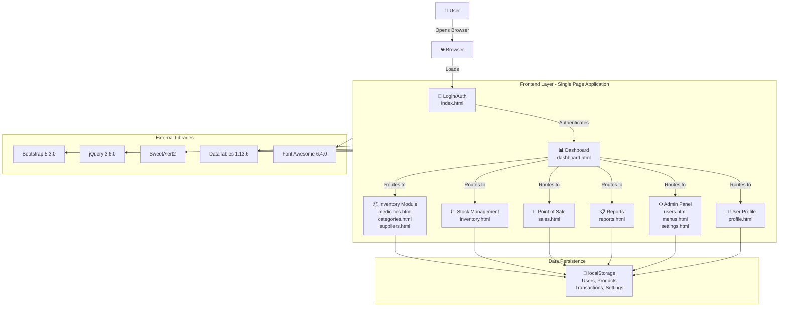
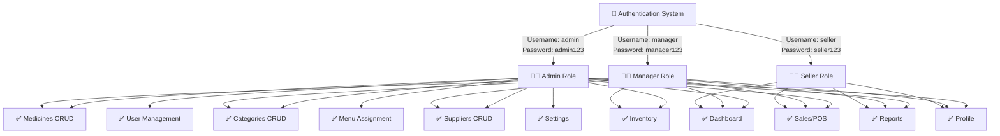
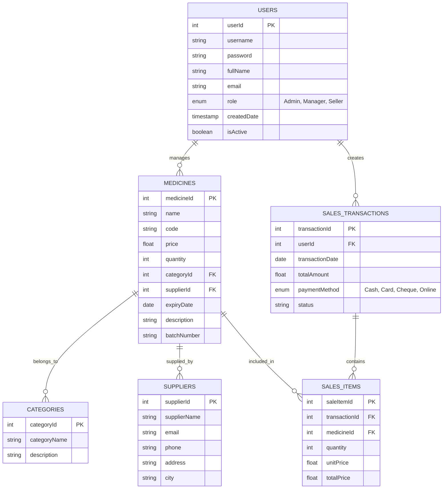
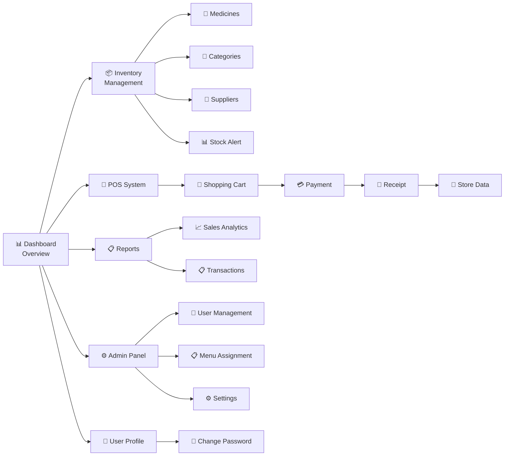
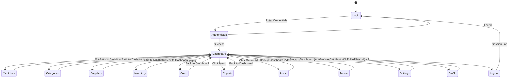
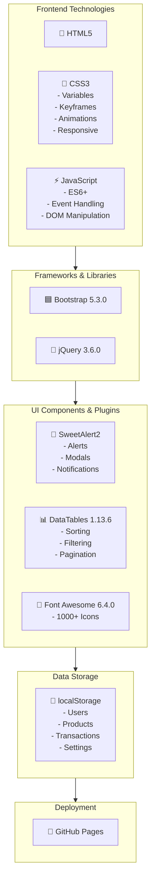
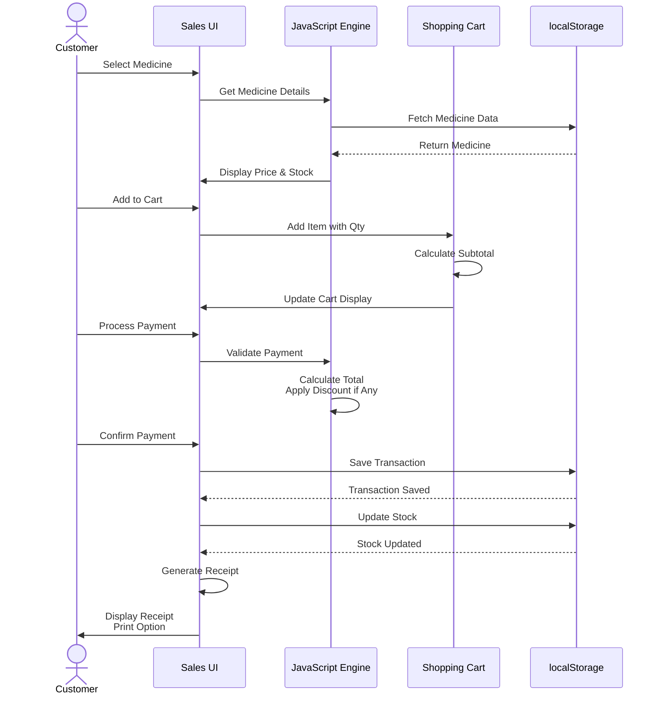
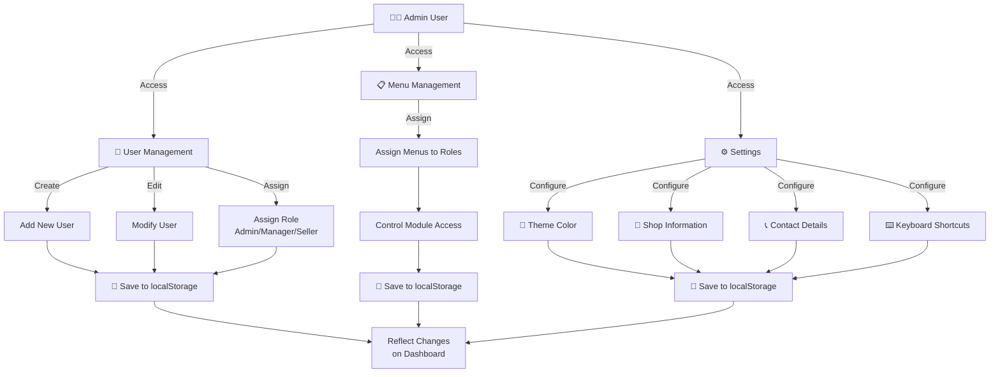
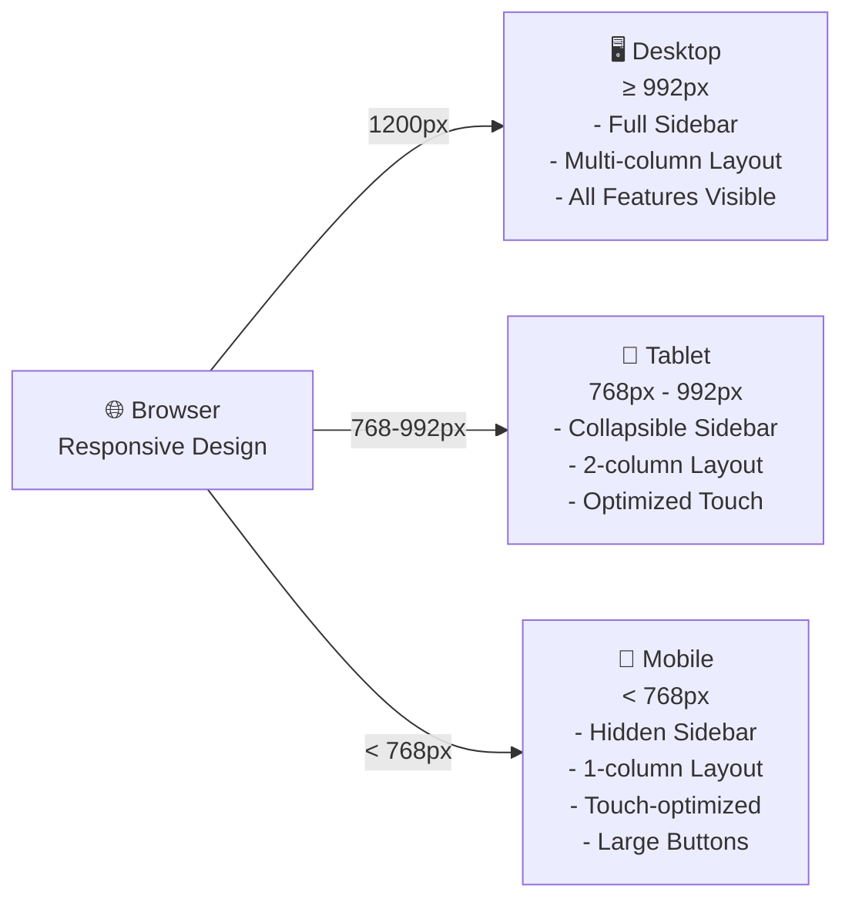

# MediShop Application Architecture - Mermaid Diagrams

## 1. System Architecture Overview

## 2. Role-Based Access Control (RBAC)

## 3. Data Model & Relationships

## 4. Module Interaction Flow

## 5. Page Flow & Navigation

## 6. Feature Dependency Tree

```mermaid
graph TD
    MediShop["🏥 MediShop<br/>Inventory System"]

    MediShop --> Auth["🔐 Authentication"]
    Auth --> Login["Login"]
    Auth --> Logout["Logout"]
    Auth --> RBAC["Role-Based Access"]

    MediShop --> Dashboard["📊 Dashboard"]
    Dashboard --> Stats["Statistics"]
    Dashboard --> Calculator["Calculator<br/>Ctrl+Shift+C"]
    Dashboard --> RecentTx["Recent Transactions"]

    MediShop --> Inventory["📦 Inventory"]
    Inventory --> Medicines["Medicines<br/>CRUD"]
    Inventory --> Categories["Categories<br/>CRUD"]
    Inventory --> Suppliers["Suppliers<br/>CRUD"]
    Inventory --> Stock["Stock<br/>Management"]

    MediShop --> Sales["🛒 Sales/POS"]
    Sales --> Cart["Shopping Cart"]
    Sales --> Payment["Payment Methods<br/>Cash, Card, Cheque, Online"]
    Sales --> Receipt["Receipt Generation"]

    MediShop --> Reports["📋 Reporting"]
    Reports --> SalesAnalytics["Sales Analytics"]
    Reports --> TransactionLog["Transaction Log"]
    Reports --> DateFilter["Date Filtering"]

    MediShop --> Admin["⚙️ Administration"]
    Admin --> UserMgmt["User Management"]
    Admin --> MenuMgmt["Menu Role Assignment"]
    Admin --> Settings["Settings &<br/>Configuration"]
    Admin --> Theme["Theme<br/>Customization"]

    MediShop --> Profile["👤 User Profile"]
    Profile --> ViewInfo["View Information"]
    Profile --> ChangePassword["Change Password"]
```

## 7. Technology Stack

## 8. Data Flow - Sales Transaction

## 9. Admin Configuration Flow

## 10. Responsive Design Breakpoints

